# Tugas 3

## Arsitektur Sistem

Sistem terdiri dari tiga klaster utama yang dikelola secara terpisah, ditambah dengan Redis sebagai backend storage sementara:

1. **Lock Manager Cluster (Konsensus Raft)**
   - Terdiri dari 3 node yang memastikan mutual exclusion menggunakan algoritma Raft.
   - Digunakan untuk mengunci resource saat seorang user mencoba membeli, mencegah race conditions.
2. **Cache Cluster (Koherensi MESI)**
   - Terdiri dari 3 node cache in-memory dengan kebijakan LRU.
   - Menggunakan protokol MESI (Modified, Exclusive, Shared, Invalid) untuk menjaga agar semua node memiliki pandangan data yang sama.
3. **Queue Cluster (Konsensus PBFT)**
   - Terdiri dari 3 node message queue.
   - Bertugas mengelola antrean pesanan yang masuk secara teratur.
   - Menggunakan algoritma PBFT (Practical Byzantine Fault Tolerance) untuk mencapai kesepakatan pesanan bahkan jika ada node yang lambat atau bermasalah.
4. **Redis Backend**
   - Digunakan sebagai persistent/backing storage sementara untuk state lock dan antrean akhir.
   


## Algoritma PBFT (Practical Byzantine Fault Tolerance)

Algoritma PBFT digunakan pada **Queue Cluster** untuk memastikan semua node sepakat terhadap urutan pesanan (message) yang masuk ke dalam antrean, sehingga tidak ada pesanan yang hilang atau terduplikasi meskipun terdapat node yang mengalami kegagalan (faulty).

Alur PBFT dalam sistem ini dibagi menjadi 3 fase utama:
1. **Pre-Prepare**: Node penerima request (berfungsi sebagai Primary untuk request tersebut) membuat proposal message dan mengirimkan pesan `pre-prepare` ke semua node lain di dalam klaster.
2. **Prepare**: Node yang menerima pesan `pre-prepare` akan memvalidasi pesan tersebut. Jika valid, node akan melakukan "self-vote" dan menyebarkan pesan `prepare` ke seluruh node lainnya.
3. **Commit**: Setelah sebuah node menerima pesan `prepare` dari mayoritas node (mencapai batas kuorum, dalam klaster 3 node adalah $2f+1 = 2$), node tersebut akan beralih ke fase `commit` dan menyebarkan pesan `commit`. Jika pesan `commit` juga telah mencapai kuorum, pesanan dianggap sah (committed) dan secara permanen dimasukkan ke dalam antrean (Redis).

## Deployment & Troubleshooting

### Prasyarat
- Docker dan Docker Compose
- Python 3.11+ dan `uv`

### Langkah Deployment
1. Jalankan semua layanan menggunakan Docker Compose di background:
   ```bash
   docker compose up --build -d
   ```
2. Sistem akan mem-booting: 
   - 3 Lock Nodes (Port `8001-8003`)
   - 3 Queue Nodes (Port `8011-8013`)
   - 3 Cache Nodes (Port `8021-8023`)
   - 1 Redis node (Port `6379`)
3. (Opsional) Untuk menjalankan *test_runner* (Unit & Integration tests) secara otomatis:
   ```bash
   docker compose up --build test_runner
   ```

### Troubleshooting
- **Masalah**: Node tidak saling sinkron atau State tidak konsisten.
  - **Solusi**: Cek log Docker dengan `docker compose logs -f <nama_service>`. Pastikan variabel environment `CLUSTER_NODES` pada `docker-compose.yml` telah terisi string URL peer node dengan benar.
- **Masalah**: Pesanan gagal masuk antrean terus-menerus.
  - **Solusi**: Algoritma PBFT membutuhkan kuorum mayoritas untuk beroperasi. Jika 2 dari 3 Queue Node mati, konsensus tidak akan pernah tercapai. Pastikan setidaknya 2 Queue Node berstatus *Up*.

## Dokumentasi API

Sistem menyediakan beberapa endpoint REST API. Spesifikasi OpenAPI lengkap dapat dilihat pada [docs/api_specification.yaml](docs/api_specification.yaml):

### Health Check
- `GET /health` : Mengecek status node, mengembalikan `node_id` dan tipe node (`node_type`).

### Lock Manager (Raft)
- `POST /lock/acquire` : Meminta distributed lock untuk resource tertentu.
  - Body: `{ "resource_id": "string", "owner_id": "string", "timeout": int }`
- `POST /lock/release` : Melepaskan distributed lock.
  - Body: `{ "resource_id": "string", "owner_id": "string" }`
- `POST /raft/request_vote` & `POST /raft/append_entries` : RPC internal antar node Raft.

### Cache Cluster (MESI)
- `GET /cache/{key}` : Membaca data dari cache. Jika tidak ada di lokal, ia akan mengkueri peer lain.
- `POST /cache/{key}` : Menulis data ke cache dan secara bersamaan melakukan broadcast invalidasi ke node peer lain.
  - Body: `{ "value": "string", "version": int }`
- `POST /mesi/read` & `POST /mesi/invalidate` : Endpoint internal antar node Cache untuk menjaga status protokol MESI.

### Queue Cluster (PBFT)
- `POST /queue/publish` : Mempublikasikan pesan baru ke antrean menggunakan mekanisme konsensus PBFT.
  - Body: `{ "topic": "string", "message": {} }`
- `POST /queue/consume` : Mengambil (consume) pesan dari antrean.
  - Body: `{ "consumer_id": "string", "topic": "string" }`
- `POST /queue/ack` & `POST /queue/nack` : Konfirmasi pemrosesan pesan (Acknowledge / Negative Acknowledge) yang mengatur apakah pesan perlu dicoba ulang (retry) atau dibuang.
- `POST /pbft/pre-prepare`, `POST /pbft/prepare`, `POST /pbft/commit` : RPC internal antar node antrean untuk perpindahan state dalam algoritma PBFT.
