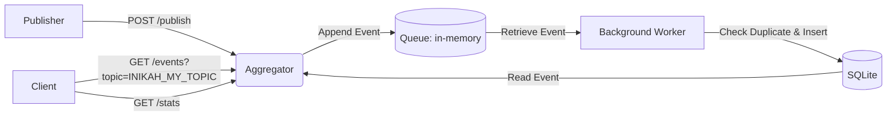

# Pub-Sub Log Aggregator Terdistribusi dengan Idempotent Consumer, Deduplication, dan Transaksi/Kontrol Konkurensi 

UAS Sistem Terdistribusi dan Parallel

| Nama  | Bagus Nur Andiansyah          |
|-------|-------------------------------|
| NIM   | 11231015                      |
| Link  | https://youtu.be/0zUMGmZq29Y  |

## Ringkasan Sistem & Arsitektur


Arsitektur sistem log aggregator terdiri atas komponen Publisher, Aggregator, Queue, Background Worker, dan DBMS SQLite yang saling terhubung membentuk arsitektur Publish-Subscribe.
Publisher mengirimkan event ke Aggregator melalui endpoint `POST /publish`.
Aggregator kemudian menambahkan event ke dalam antrian berbasis memori (in-memory queue) untuk diproses secara asinkron.
Background Worker mengambil event dari queue, melakukan pemeriksaan duplikasi, dan menyimpannya ke dalam basis data SQLite.
Data yang telah tersimpan dapat diakses kembali oleh Aggregator untuk melayani permintaan dari pengguna / client melalui endpoint `GET /events` untuk mengambil data berdasarkan topik tertentu dan `GET /stats` untuk memperoleh informasi metrik sistem.




## Soal Teori

### Karakteristik sistem terdistribusi dan trade-off desain Pub-Sub aggregator.

Sistem terdistribusi memiliki sejumlah karakteristik utama, antara lain resource sharing, transparansi, openness, dependability, security, dan scalability. Resource sharing memungkinkan berbagai komponen dalam sistem untuk saling berbagi sumber daya secara efisien. Transparansi mengacu pada kemampuan sistem dalam menyembunyikan kompleksitas distribusi, sehingga pengguna maupun aplikasi tidak perlu mengetahui detail lokasi atau pembagian proses. Openness menunjukkan bahwa sistem dirancang dengan standar terbuka sehingga mudah diintegrasikan dengan sistem lain. Dependability berkaitan dengan tingkat keandalan sistem dalam menjalankan fungsinya sesuai ekspektasi, sedangkan security menekankan aspek perlindungan terhadap data dan akses. Scalability menggambarkan kemampuan sistem untuk berkembang sesuai peningkatan beban atau kebutuhan (Steen & Tanenbaum, 2023, hlm. 10-24).

Dalam konteks layanan aggregator, tidak semua karakteristik tersebut memiliki tingkat kepentingan yang sama. Resource sharing menjadi penting karena sistem perlu mengelola data dari berbagai sumber secara efisien. Openness juga relevan agar integrasi dengan beragam publisher dapat dilakukan dengan mudah. Selain itu, scalability merupakan faktor krusial mengingat volume data yang dapat meningkat secara signifikan. Sementara itu, karakteristik lain seperti transparansi, dependability, dan security tetap relevan, namun umumnya tidak menjadi fokus utama dibandingkan kebutuhan integrasi dan skalabilitas pada layanan aggregator.


### Kapan memilih arsitektur publish–subscribe dibanding client–server? Alasan teknis.

Arsitektur client-server terdiri dari dua komponen utama, yaitu server sebagai penyedia layanan yang memproses tugas tertentu, serta client sebagai pihak yang mengirim permintaan untuk memperoleh hasil layanan tersebut. Dalam model ini, client mengirim request ke server dan menunggu respons yang diberikan setelah proses selesai (Steen & Tanenbaum, 2023, hlm. 79).

Sebaliknya, arsitektur publish-subscribe melibatkan mekanisme komunikasi yang tidak langsung antara pengirim dan penerima data. Subscriber menerima data atau event dari satu atau lebih publisher melalui perantara broker, tanpa perlu mengetahui sumber data secara spesifik. Proses ini bersifat asinkron, sehingga tidak terdapat ketergantungan waktu antara pengirim dan penerima (Steen & Tanenbaum, 2023, hlm. 70).

Dalam konteks layanan aggregator, sistem umumnya perlu mengumpulkan data dari berbagai sumber dengan karakteristik yang tidak bersifat time-critical. Oleh karena itu, arsitektur publish-subscribe lebih sesuai digunakan dibandingkan client-server. Pendekatan ini menghindari proses sinkron yang bersifat blocking, sehingga pengumpulan dan distribusi data dapat berlangsung lebih efisien. Selain itu, baik publisher maupun subscriber tidak perlu menunggu proses satu sama lain, yang pada akhirnya meningkatkan skalabilitas dan efisiensi sistem agregasi data.


### At-least-once vs exactly-once delivery; peran idempotent consumer

Dalam mekanisme penanganan kegagalan (failure handling), terdapat semantik komunikasi at-least-once dan exactly-once. Semantik at-least-once mengharuskan proses pengiriman pesan diulang sampai respons diterima minimal satu kali. Sementara itu, exactly-once menjamin bahwa setiap pesan diproses dan menghasilkan respons tepat satu kali tanpa adanya duplikasi proses (Steen & Tanenbaum, 2023, hlm. 511).

Konsep idempotent customer berkaitan dengan kemampuan klien untuk mengirim ulang pesan tanpa menyebabkan perubahan keadaan yang berbeda pada sistem. Dengan sifat idempotent, pengulangan pengiriman tidak menimbulkan efek samping tambahan pada state sistem (Steen & Tanenbaum, 2023, hlm. 512). Sebaliknya, jika suatu sistem tidak bersifat idempotent, setiap pengiriman ulang dapat menghasilkan perubahan state yang berbeda sehingga berpotensi menimbulkan inkonsistensi. Hal ini dapat memicu masalah lanjutan dalam proses komunikasi dan pemrosesan data. Contoh operasi yang tidak idempotent adalah transfer uang, karena setiap eksekusi ulang dapat menyebabkan perubahan saldo yang tidak diinginkan dan tidak konsisten dengan kondisi awal transaksi.


### At-least-once vs exactly-once delivery; peran idempotent consumer.

Dalam perancangan skema penamaan untuk topic dan event_id, aspek keunikan data serta kemungkinan terjadinya collision perlu diperhatikan. Topic umumnya dapat menggunakan string identifier sederhana untuk mempermudah pengelolaan dan pengelompokan. Namun, penentuan event_id memerlukan perhatian lebih karena harus memenuhi karakteristik sebagai identifier yang benar. Menurut Steen dan Tanenbaum (2023, hlm. 328), identifier yang ideal (true identifier) memiliki tiga sifat utama, yaitu setiap identifier merujuk pada tepat satu entitas, setiap entitas hanya memiliki satu identifier, dan identifier tidak digunakan ulang sehingga selalu merujuk pada entitas yang sama.

Dalam sistem publish-subscribe yang bersifat terdistribusi dengan banyak publisher, diperlukan mekanisme penamaan yang unik dan tahan terhadap collision. Collision terjadi ketika dua atau lebih sistem menghasilkan identifier yang sama untuk entitas yang berbeda. Untuk mengurangi risiko tersebut, dapat digunakan UUID sebagai alternatif. UUID versi 4 merupakan identifier 128-bit yang dihasilkan secara acak dan dirancang untuk sistem terdistribusi. Dengan 122-bit entropy, kemungkinan terjadinya collision menjadi sangat kecil, sehingga UUID v4 dapat digunakan untuk menjaga keunikan event_id. Dengan demikian dapat data dapat dijamin unik dalam proses dedupliksi.


### Ordering praktis (timestamp + monotonic counter); batasan dan dampaknya

Menurut Steen dan Tanenbaum (2023, hlm. 274), total ordering adalah mekanisme pengurutan yang memastikan seluruh event dalam sistem terdistribusi tersusun sesuai urutan terjadinya. Dengan pendekatan ini, setiap event memiliki posisi yang konsisten dalam urutan global sehingga hubungan temporal antar event dapat direpresentasikan secara jelas.

Salah satu cara yang umum digunakan untuk mencapai total ordering adalah dengan memanfaatkan timestamp pada setiap event. Secara ideal, timestamp yang digunakan bersifat monotonic pada setiap node dalam sistem terdistribusi, sehingga selalu meningkat seiring waktu dan tidak mengalami regresi nilai. Namun, dalam praktiknya, penerapan timestamp monotonic sering kali sulit dicapai karena keterbatasan mekanisme sinkronisasi waktu antar node.

Sebagai alternatif, dapat digunakan timestamp berbasis waktu standar yang tidak dipengaruhi oleh zona waktu (timezone). Meskipun pendekatan ini tidak sepenuhnya menjamin sifat monotonic secara global, dalam banyak kasus sistem terdistribusi, pendekatan tersebut sudah cukup untuk menyediakan urutan event yang konsisten secara operasional. Dengan demikian, penggunaan timestamp standar tetap menjadi solusi yang praktis untuk kebutuhan total ordering pada berbagai aplikasi terdistribusi.


### Failure modes dan mitigasi (retry, backoff, durable dedup store, crash recovery).

Dalam sistem terdistribusi, terdapat beberapa permasalahan umum yang dapat memengaruhi konsistensi sistem. Salah satunya adalah duplikasi data, yaitu kondisi ketika data yang sama muncul lebih dari satu kali dan berpotensi menimbulkan efek samping yang tidak diinginkan pada hasil pemrosesan. Permasalahan ini dapat dimitigasi dengan menggunakan deduplication store, yaitu mekanisme penyimpanan yang memfilter data masuk dan menghapus entri duplikat sehingga hanya data unik yang diproses lebih lanjut.

Selain itu, kondisi out-of-order dapat terjadi ketika data diterima tidak sesuai dengan urutan yang diharapkan oleh sistem. Hal ini dapat mengganggu proses agregasi yang bergantung pada urutan event. Untuk mengatasinya, dapat digunakan timestamp sebagai acuan pengurutan, serta mekanisme backoff untuk menunda pemrosesan sementara hingga data yang hilang atau tertunda dapat diterima dan urutan yang benar dapat dipulihkan.

Permasalahan lain adalah crash, yaitu kondisi ketika sistem mengalami kegagalan eksekusi akibat exception dan tidak dapat melanjutkan proses secara normal (Steen & Tanenbaum, 2023, hlm. 20). Untuk memitigasi hal ini, dapat diterapkan mekanisme retry dengan penambahan jeda waktu (delay) antar percobaan.

### Eventual consistency pada aggregator; peran idempotency + dedup.

Dalam layanan aggregator, eventual consistency dicapai melalui kombinasi proses deduplikasi dan penerapan idempotency pada event yang masuk. Idempotency memastikan bahwa pemrosesan ulang terhadap event yang sama tidak menghasilkan perubahan state yang berbeda, sehingga setiap event dapat diproses secara aman meskipun terjadi pengiriman ulang. Setelah itu, mekanisme deduplikasi digunakan untuk mengidentifikasi dan menghapus event yang dianggap duplikat, sehingga hanya event unik yang dipertahankan untuk setiap topik.

Pada sistem yang bersifat terdistribusi, aggregator dapat dijalankan pada beberapa node untuk meningkatkan skalabilitas dan ketersediaan. Dalam kondisi ini, setiap node dapat menerima subset event yang berbeda akibat distribusi beban dan sifat asinkron sistem. Namun, karena adanya idempotency dan deduplikasi, event yang sama akan menghasilkan state akhir yang konsisten meskipun diproses lebih dari satu kali atau pada node yang berbeda.

Seiring waktu, seluruh node akan mengelola himpunan event unik yang serupa, meskipun terdapat perbedaan sementara selama proses propagasi data. Kondisi ini menunjukkan bahwa sistem mencapai eventual consistency, yaitu keadaan ketika seluruh replika data pada akhirnya menjadi konsisten setelah periode sinkronisasi dalam sistem terdistribusi (Steen & Tanenbaum, 2023, hlm. 512).

### Desain transaksi: ACID, isolation level, dan strategi menghindari lost-update.

Sistem memanfaatkan konsep ACID (Atomicity, Consistency, Isolation, dan Durability) guna menjamin _reliability_ transaksi. Atomicity memastikan seluruh operasi dalam transaksi dieksekusi secara utuh atau dibatalkan sepenuhnya, sedangkan Consistency menjaga agar perubahan data tetap memenuhi aturan dan integritas data. Isolation mengatur agar transaksi yang berjalan secara bersamaan tidak menginterupsi satu sama lain, sementara Durability menjamin bahwa data yang telah dicommit tetap tersimpan meskipun terjadi kegagalan sistem.

Digunakan pula isolation level SERIALIZABLE yang secara default digunakan oleh SQLite. SERIALIZABLE menjamin tiap transaction yang dibuat melihat state yang sama seperti sebelum transaction dimulai.
Selain itu, penggunaan transaction di sini juga merupakan strategi menghindari lost-update.


### Kontrol konkurensi: locking/unique constraints/upsert; idempotent write pattern.

Dalam sistem terdistribusi, tidak jarang banyak pihak (party) saling mengakses dan menulis pada resource yang sama.
Guna menghindari ketidakkonsistensian data akibat race condition pada proses writing, digunakan unique constraints pada key (topic, event_id) pada event.
Dengan demikian, duplikasi data dapat dihindari karena adanya unique constraints tersebut.


### Orkestrasi Compose, keamanan jaringan lokal, persistensi (volume), observability.

Dalam sistem terdistribusi, orkestrasi layanan menggunakan Docker Compose digunakan untuk mengelola beberapa komponen aplikasi yang berjalan dalam container secara terkoordinasi. Melalui konfigurasi terpusat, setiap layanan dapat didefinisikan beserta dependensi, jaringan, dan sumber daya yang diperlukan. Pendekatan ini mempermudah proses deployment, maintenacne, serta reproducibility sistem pada berbagai platform.

Keamanan jaringan lokal diterapkan untuk membatasi komunikasi antar layanan sesuai kebutuhan sistem, sedangkan persistensi data melalui volume digunakan untuk menjaga availability data meskipun container dihentikan atau dibuat ulang. Observability mendukung pemantauan kondisi sistem melalui mekanisme logging dan metrik, sehingga memudahkan proses identifikasi, analisis, dan troubleshooting selama sistem beroperasi.

## Keputusan Desain Sistem

Keputusan desain sistem mencakup beberapa aspek penting untuk menjamin relibility pemrosesan event.
Idempotency diterapkan agar setiap event yang sama tidak diproses lebih dari satu kali, sehingga sistem tetap konsisten meskipun terjadi pengiriman ulang dari Publisher.
Untuk mendukung hal ini, digunakan mekanisme deduplication store yang menyimpan identitas unik event sebagai acuan dalam mendeteksi duplikasi sebelum dilakukan penyimpanan ke database.
Seluruh proses manipulasi (dalam kasus ini insert) ke dalam database dilakukan dalam transaction dengan isolation level SERIALIZABLE.
Dari sisi ordering, sistem tidak menjamin urutan global antar event karena penggunaan antrian dan pemrosesan asinkron, namun urutan dapat dipertahankan secara terbatas, menggunakan timestamp dari event.
Selain itu, mekanisme retry disediakan pada Background Worker untuk menangani kegagalan sementara saat pemrosesan atau penyimpanan, dengan tetap memperhatikan prinsip idempotency agar tidak menimbulkan inkonsistensi data.

## Analisis Metrik & Uji Konkurensi

Untuk uji performa & konkurensi, dilakukan *stress test* dengan 4 replica aggregator dengan menggunakan option  `--scale aggregator=4` pada command Docker Compose.
Publisher menghasilkan setidaknya 20.000 event dengan tingkat duplikasi sebesar 30%, serta 10% peluang mengirimkan event secara batch.

Aggregator 1
```json
{
   "received":7695,
   "unique_processed":32777,
   "duplicate_dropped":958,
   "topics":[
      "inventory",
      "notifications",
      "orders"
   ],
   "uptime":125.35621929168701
}
```

Aggregator 2 
```json
{
   "received":7444,
   "unique_processed":32777,
   "duplicate_dropped":1019,
   "topics":[
      "inventory",
      "notifications",
      "orders"
   ],
   "uptime":127.6377694606781
}
```

Aggregator 3
```json
{
  "received":7214,
  "unique_processed":32777,
  "duplicate_dropped":922,
  "topics":[
    "inventory",
    "notifications",
    "orders"
  ],
  "uptime":127.6377694606781
}
```

Aggregator 4
```json
{
   "received":7065,
   "unique_processed":32777,
   "duplicate_dropped":929,
   "topics":[
      "inventory",
      "notifications",
      "orders"
   ],
   "uptime":125.07017874717712
}
```

Hasil pengujian menunjukkan bahwa keseluruhan sistem menerima 32777 event unik yang berhasil diproses.
Setiap aggregator juga berhasil menerima rata-rata sekitar 7300 event, dengan rata-rata sekitar 950 event di antaranya teridentifikasi sebagai duplikat sehingga tidak diproses lebih lanjut.
Hal ini menunjukkan efektivitas mekanisme deduplikasi dalam menjaga konsistensi data dalam kasus konkurensi.
Seluruh proses berlangsung dalam waktu sekitar 127 detik, yang mengindikasikan bahwa arsitektur berbasis antrian dan pemrosesan asinkron mampu mempertahankan throughput yang stabil di bawah beban tinggi serta skenario input yang tidak seragam tanpa indikasi penurunan kinerja yang signifikan.


## Keterkaitan

| Konsep                                             | Implementasi dalam Sistem                                                                                                                                                                                         | Sitasi Halaman     |
|----------------------------------------------------|-------------------------------------------------------------------------------------------------------------------------------------------------------------------------------------------------------------------|--------------------|
| Karakteristik sistem terdistribusi pada aggregator | Aggregator berfungsi sebagai komponen pusat yang menerima event dari Publisher, sementara pemrosesan dilakukan secara terpisah melalui Background Worker dan in-memory queue untuk mendukung pemrosesan asinkron. | hlm. 10–24         |
| Client-server vs publish-subscribe                 | Sistem menggabungkan model client-server pada endpoint query (`GET /events`, `GET /stats`) dan pola publish-subscribe secara implisit melalui pengiriman event dari Publisher ke Aggregator berdasarkan topik.    | hlm. 70, hlm. 79   |
| Delivery semantics & idempotency                   | Sistem menerapkan at-least-once delivery dengan mekanisme idempotency untuk memastikan event yang sama tidak diproses lebih dari satu kali, meskipun terjadi pengiriman ulang.                                    | hlm. 511, hlm. 512 |
| Skema penamaan topic & event_id                    | Event dikelompokkan berdasarkan `topic` (misalnya inventory, orders, notifications) dan setiap event memiliki `event_id` unik sebagai dasar deduplikasi dan identifikasi.                                         | hlm. 328           |
| Ordering (total ordering)                          | Sistem tidak menjamin total ordering global; urutan event bersifat terbatas dan bergantung pada antrian serta waktu pemrosesan oleh worker.                                                                       | hlm. 274           |
| Failure model & mitigasi                           | Kegagalan sementara pada worker atau database ditangani dengan mekanisme retry, sementara duplikasi akibat retry diatasi melalui deduplication store.                                                             | hlm. 20            |
| Eventual consistency pada aggregator               | Konsistensi data pada Aggregator bersifat eventual, karena event diproses secara asinkron melalui queue sebelum tersedia untuk query.                                                                             | hlm. 512           |
| Metrik evaluasi sistem                             | Evaluasi dilakukan menggunakan stress test dengan 7.569 event diterima, 6.572 event unik diproses, 997 duplikasi terdeteksi, dan uptime 26,11 detik untuk mengukur throughput dan efektivitas deduplikasi.        | hlm. 454           |


## Daftar Pustaka
- van Steen, M., & Tanenbaum, A. S. (2023). _Distributed systems_ (edisi ke-4). https://www.distributed-systems.net/